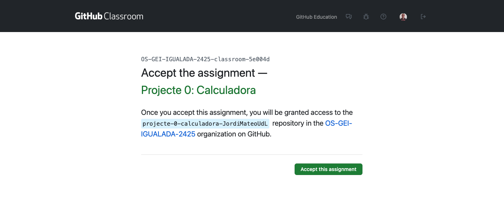
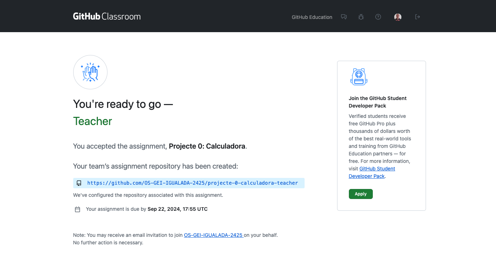
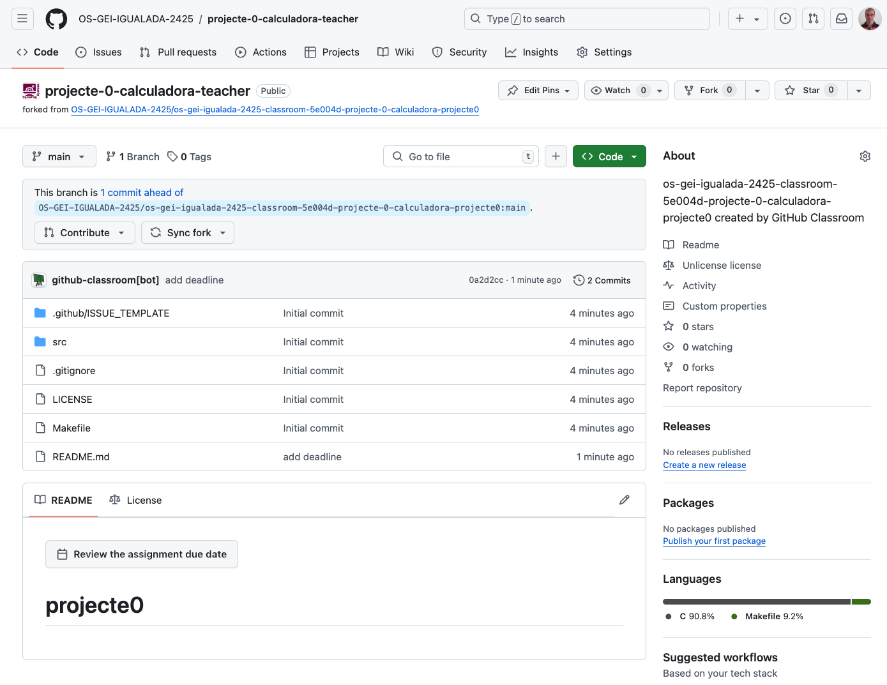
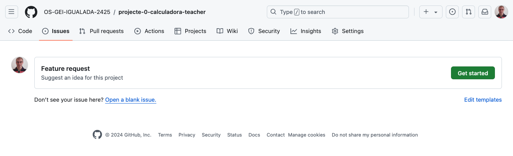

# Projecte Col·laboratiu: Calculadora

En aquest projecte, treballarem en equip per a desenvolupar una calculadora senzilla en C de forma cooperativa. Aquest projecte ens permetrà repassar els conceptes bàsics de programació en *C* i introduir-nos en el treball col·laboratiu amb les eines de control de versions com: **Git i GitHub**.

## Objectius

- Consolidar els coneixements bàsics de programació en C.
- Comprendre l’estructura d’un projecte modular en C.
- Utilitzar Git per gestionar el control de versions del projecte.
- Col·laborar en equip utilitzant GitHub.
- Desenvolupar una aplicació funcional en C i documentar adequadament el projecte.

## Tasques

### Creació d'equips

1. Formeu equips de 3 persones. Cada grup haurà d'escollir un **líder**, que serà el responsable de coordinar el treball, gestionar el repositori i fer el seguiment del projecte.

2. Trieu un nom d'equip original.

### Preparació del projecte

Enllaç de la tasca a GitHub Classroom: [https://classroom.github.com/a/YXJZBzDs](https://classroom.github.com/a/YXJZBzDs)

1. El líder de l'equip haurà d’iniciar el grup a través de GitHub Classroom.

    - Introdueix el nom de l'equip.
  
        

    - Accepta la tasca.

        

    - Un cop acceptada la tasca, es crearà un repositori per a l'equip.

        

2. La resta de membres s’hi podran unir seleccionant el nom de l’equip al mateix enllaç [https://classroom.github.com/a/YXJZBzDs](https://classroom.github.com/a/YXJZBzDs).

3. El repositori base contindrà el codi inicial necessari i la seva estructura.

    

4. El líder és responsable d'assignar les tasques a cada membre mitjançant issues a GitHub.

    Per fer-ho:

    1. Fer clic a la pestanya **Issues**.

        

    2. Fer clic a **New issue**.

        

    3. Us he preparat una plantilla per a les issues. Feu clic a **Get started**.

        

    4. Omplir el títol i la descripció de la tasca.
    5. Assignar la tasca a un membre de l'equip. Click a **Assignees** i seleccionar el membre.
    6. Un cop assignada la tasca, fer clic a **Submit new issue**.

    Llista de tasques i assignació:

    | Tasca | Assignat a |
    |-------|------------|
    | Implementació de la funció de suma | líder |
    | Implementació de la funció de resta | líder |
    | Implementació de la funció de multiplicació | membre1|
    | Implementació de la funció de divisió | membre1 |
    | Implementació de la funció de potència | membre2 |
    | Implementació de la funció de arrels quadrades | membre2 |

### Treball individual

1. Cada membre de l'equip haurà de clonar el repositori al seu ordinador i crear una branca `develop` per les seves tasques.

    ```sh
    git clone URL_DEL_REPOSITORI
    cd NOM_DEL_REPOSITORI
    ```

    > **Informació**
    >
    > Si feu clic a **Code** al repositori, podreu copiar la URL del repositori.

    

    > **Recomanació**
    >
    > Tanqueu la sessió de VSCode i torneu-la a obrir però indicant la ruta a la carpeta del projecte. En el meu cas, seria `/home/jordi/test/projecte-0-calculadora-teacher`. D'aquesta manera, podreu utilitzar les eines de VSCode per a desenvolupar el projecte.
    >
    > 
    >
    > 

2. Per cada tasca assignada, el membre haurà de crear una branca amb el nom de la tasca. Per exemple, si la tasca és implementar la funció de suma, la branca es podria anomenar `feature-suma`.

    ```sh
    git checkout -b feature-suma
    ```

    Observeu que VSCode us mostra la branca actual a la part inferior esquerra.

    

3. El codi de la funció suma podria ser:

    ```c
    // calc.c
    int suma(int a, int b) {
        return a + b;
    }
    ```

    ```c
    // calc.h
    int suma(int a, int b);
    ```

4. Compileu el codi i comproveu que funciona correctament.

    ```sh
    make
    ./calc
    ```

    

    Si tot funciona correctament, el codi s'executarà i mostrarà el resultat de la suma.

5. Un cop finalitzada la tasca, fer un `commit` amb els canvis realitzats indicant la tasca realitzada.

    Ho podeu fer amb les eines de VSCode o amb la terminal.

    Si feu servir la terminal, la comanda seria:

    ```sh
    git add src/calc.c src/calc.h src/main.c
    git commit -m "@feat: Implementació de la funció de suma"
    ```

    

    > **Compte!**
    >
    > Si no feu `git add` abans de fer el `commit`, no es pujaran els canvis al repositori. Així que assegureu-vos de fer `git add` abans de fer el `commit`.

    ---

    > **TIP:**
    >
    > Utilitza els missatges de commit per tancar les issues relacionades amb la tasca. Per exemple, si la tasca és implementar la funció de suma, el missatge de commit podria ser: `git commit -m "@feat: Implementació de la funció de suma. Closes #1"`. Si la tasca 1 és la implementació de la funció de suma.

    Per fer-ho amb VSCode, feu clic a la icona de la branca a la part inferior esquerra i seleccioneu **Commit**. Després, introduïu el missatge de commit i confirmeu-lo.

    

6. Repeteix els passos 2 i 3 per a cada tasca assignada. Sempre creant la branca des de `main`. Per tornar a la branca `main`, feu `git checkout main`. O bé, click a la branca a la part inferior esquerra de VSCode i seleccioneu `main`.

7. Un cop finalitzades les seves tasques ajuntarem totes les branques a la nostra branca local `main`.

    - Per fer-ho, amb la terminal, farem:

        ```sh
        git checkout -b main
        git merge feature-suma 
        ```

        

        > **Compte!**
        >
        > Si hi ha conflictes, caldrà resoldre'ls abans de fer el `commit`.

    - Per fer-ho amb VSCode, farem clic a la icona de la branca a la part inferior esquerra i seleccionarem **Merge branch into current**.

        

    - Seleccioneu la branca a ajuntar.

        

    - Quan integreu la segona funcionalitat (resta, multiplicació, etc.), caldrà fer un `merge` ja que es detectaran conflictes.

        

    - Un dels conflictes es el fitxer `calc.c`. Cada branca ha modificat aquest fitxer i caldrà resoldre els conflictes. Acceptant els canvis de les dues branques. Podeu fer-ho manualment o amb el resolutor de conflictes de VSCode.

        

    - Repetiu el mateix procediment per tots els conflictes que apareguin.

    - Un cop resolts els conflictes, feu un `commit` amb el missatge `@feat: Merge branch 'feature-resta`.

### Ajuntar les tasques

1. Un cop totes les tasques estiguin implementades i ajuntades a la branca `main`, caldrà testar que el codi funciona correctament.

2. Aquestes tasques estaràn en la branca `main` del repositori local. Ara caldrà pujar aquestes tasques al repositori remot.

    - Crea a GitHub una branca remota anomenada `develop-<nom-usuari>` i la vincularem amb la branca `main` local.

    

    Primer, caldrà actualitzar les branques remotes del repositori.

    ```sh
    git fetch origin
    ```

    

    Un cop actualitzades les branques remotes, caldrà fer un `push` de la branca `main` a la branca `develop-<nom-usuari>`.

    ```sh
    git push origin main:develop-<nom-usuari>
    ```

3. Un cop pujades totes les tasques al repositori remot, el líder actualitzarà les branques remotes de tots els membres de l'equip.

    ```sh
    git fetch origin
    ```

4. Fara un `merge` de totes les tasques a la seva branca `main`.

5. Finalment, testeu que el codi funciona correctament.

6. Un cop testejat, caldrà pujar la branca `main` al repositori remot.

    ```sh
    git push origin main
    ```

### Documentació

1. Editeu el fitxer README.md i afegiu una breu descripció del projecte, el nom dels membres de l'equip i una captura de pantalla de la calculadora en funcionament.

2. Afegiu també les instruccions per a compilar i executar el projecte.

Us podeu inspirar en aquesta documentació [https://github.com/OS-GEI-IGUALADA-2425/laboratoris](https://github.com/OS-GEI-IGUALADA-2425/laboratoris) o bé podeu consultar la documentació de GitHub sobre com escriure aquest tipus de documents [https://docs.github.com/en/github/writing-on-github/basic-writing-and-formatting-syntax](https://docs.github.com/en/github/writing-on-github/basic-writing-and-formatting-syntax).

### Desplegament automàtic

Github permet compilar i generar un executables a partir del codi font. Aquesta funcionalitat es pot activar a la pestanya **Actions** del repositori. Per fer-ho, caldrà crear un fitxer de configuració anomenat `.github/workflows/build.yml` amb el següent contingut:

- Crear el fitxer de configuració:
  
    ```sh
    mkdir -p .github/workflows
    touch .github/workflows/build.yml
    ```

- Editar el fitxer `build.yml` amb el següent contingut:
  
    ```yml
    name: Build and Compile Calculator

    on:
        push:
            branches:      
                - main
    jobs:  
        build:    
            runs-on: ubuntu-latest   
            
            steps:      
                - name: Checkout Repository        
                uses: actions/checkout@v3   
                
                - name: Create bin folder
                run: mkdir bin
            
                - name: Compile Calculator 
                run: |         
                    make 
    ```

    Aquest fitxer de configuració s'executarà cada vegada que es faci un `push` a la branca `main`. Això farà que es compili el codi i es generi un executable. Aquest codi s'executarà en una màquina virtual amb Ubuntu generada per GitHub.

    Un cop configurat, es pot provar fent un `push` a la branca `main` i comprovar que es compila correctament.

A més, es pot taggejar el repositori amb una versió. Per exemple, si el codi està en la versió 1.0.0, es pot fer un tag amb aquesta versió. Per fer-ho, caldrà fer:

```sh
git tag -a v1.0.0 -m "Versió 1.0.0"
git push origin v1.0.0
```

Aquest tag permetrà descarregar el codi font de la versió 1.0.0 en qualsevol moment.

Per acabar, podeu inclús generar un `release` amb aquest tag. Això permetrà descarregar el codi font de la versió 1.0.0 amb un sol clic.

Per fer-ho, primer necessitarem crear un secret al repositori anomenat `TOKEN`. Aquest secret serà el token d'accés a GitHub. Per crear-lo, anem a **Settings** -> **Secrets** -> **New repository secret** i afegim el token d'accés. D'aquesta manera la github action podrà crear el release cada vegada que es faci un tag.

Un cop creat el secret, caldrà modificar el fitxer de configuració `build.yml` perquè generi el release. El fitxer de configuració quedaria així:

```yml
# release.yml
name: Generate Release

on:
    release:
        types: [created]

jobs:
    build:    
        runs-on: ubuntu-latest   
        
        steps:      
            - name: Checkout Repository        
            uses: actions/checkout@v3   
            
            - name: Create bin folder
            run: mkdir bin
        
            - name: Compile Calculator 
            run: |         
                make 

            - name: Create Release
            id: create_release
            uses: actions/create-release@v1
            env:
                GITHUB_TOKEN: ${{ secrets.TOKEN }}
            with:
                tag_name: ${{ github.ref }}
                release_name: Release ${{ github.ref }}
                body: |
                    Release ${{ github.ref }}
                draft: false
                prerelease: false
```

Aquest fitxer de configuració crearà un release cada vegada que es faci un tag. Aquest release es podrà descarregar amb un sol clic.
