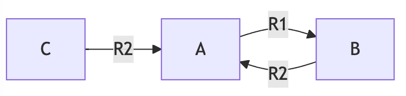

# Problemes de Deadlocks

1. Un sistema conté 2 processos (**A i B**). Hi ha *tres recursos **R1***. Cada procés necessita un màxim de 2 recursos **R1**. Es possible un interbloqueig en aquesta situació? Raoneu la resposta.

    <details>
    <summary>Veure la resposta</summary>

    - Si que pot haver-hi un interbloqueig, si el procés A obté un recurs **R1** en un  i el procés B obté un altre recurs **R1**. En aquest cas, cap dels dos processos pot continuar perquè necessiten un altre recurs **R1**. Per tant, els dos processos estan bloquejats i no poden continuar.

    - Si el procés A o B sol·licita els dos recursos **R1** al mateix temps, un dels processos obtindrà els dos recursos i l'altre procés no podrà continuar fins que el primer alliberi els recursos. En aquest cas, no hi ha interbloqueig perquè un dels processos pot continuar i desbloquejar l'altre procés.
    </details>

2. Imagina tres processos **A,B,C** i dos recursos **R1 (1)**  i **R2 (2)**.

   - A soilicita 1 instancia de R1 i el sistema operatiu li condedeix.
   - B sol·licita 1 instancia de R2 i el sistema operatiu li concedeix.
   - C sol·licita 1 instancia de R2 i el sistema operatiu li concedeix.
   - B sol·licita 1 instancia de R1 i el sistema operatiu li bloqueja.
   - A sol·licita 1 instancia de R2 i el sistema operatiu li bloqueja.

    a. Aquesta situació és un interbloqueig? Raoneu la resposta.

    <details>
    <summary>Veure la resposta</summary>

    - No és un interbloqueig perquè C pot continuar i alliberar el recurs **R2** que necessita A. Aleshores, A pot continuar i alliberar el recurs **R1** que necessita B. Finalment, B pot continuar i alliberar el recurs **R1** que necessita A.

    </details>

    b. Es compleixen les quatre condicions de Coffman per a un interbloqueig?

    <details>
    <summary>Veure la resposta</summary>

    - **Exclusió mútua**: Sí, perquè els recursos són exclusius i no poden ser compartits.
    - **Retenció i espera**: Sí, perquè els processos retenen els recursos que ja tenen i esperen els recursos que necessiten.
    - **No apropiació**: Sí, perquè els recursos no poden ser alliberats per un procés fins que no hagi acabat de fer servir els recursos.
    - **Espera circular**: No, perquè C no està esperant cap recurs que tingui un altre procés.
    </details>

3. Es possible un interbloqueig amb processos que no estan involucrats en el cicle de processos que esperen recursos? Raoneu la resposta i doneu un exemple.

    <details>
    <summary>Veure la resposta</summary>

    Sí, es possible. Per exemple, si tenim 3 processos A, B i C i 2 recursos R1 i R2. A espera R1 que el té B, B espera R2 que el té A i C espera per R2 que el té A. En aquest cas, C no està involucrat en el cicle de processos que esperen recursos però hi ha un interbloqueig.

    

    ```mermaid
    graph LR
        A -->|R1| B
        B -->|R2| A
        C -->|R2| A
    ```

    </details>

4. En un sistema format per 4 processos \\(p_1, p_2, p_3, p_4\\) i 1 únic recurs de cada tipus \\(r_0, r_1, r_2, r_3, \ldots\\), Raona si es possible un interbloqueig partint del següent graf d'espera:

    

    <details>
    <summary>Veure la resposta</summary>

    Analitzant el graf d'espera, podem construir la següent matriu:

    \\[
    \begin{gathered}
    \text{A[i,j]} =
    \begin{bmatrix}
    0 & 1 & 0 & 0 \\\\
    1 & 0 & 1 & 0 \\\\
    1 & 0 & 0 & 1 \\\\
    0 & 0 & 0 & 0
    \end{bmatrix}
    \end{gathered}
    \\]

    Aquesta matriu representa si hi ha una petició de recursos del procés \\(p_i\\) al procés \\(p_j\\). Per exemple, \\(A[0,1] = 1\\) vol dir que el procés \\(p_1\\) està esperant per un recursos assignat al procés \\(p_2\\).

    Si calculem la matriu \\(A^2\\), obtenim:

    \\[
    \begin{gathered}
    \text{A}^2 =
    \begin{bmatrix}
    1 & 0 & 1 & 0 \\\\
    1 & 1 & 0 & 1 \\\\
    0 & 1 & 0 & 0 \\\\
    0 & 0 & 0 & 0
    \end{bmatrix}
    \end{gathered}
    \\]

    Els procesos \\(p_1\\) i \\(p_2\\) estan en interbloqueix. Formen part d'un cicle de longitud 2.

    Si calculem la matriu \\(A^3\\), obtenim:

    \\[
    \begin{gathered}
    \text{A}^3 =
    \begin{bmatrix}
    1 & 1 & 0 & 1 \\\\
    1 & 1 & 1 & 0 \\\\
    1 & 0 & 1 & 0 \\\\
    0 & 0 & 0 & 0
    \end{bmatrix}
    \end{gathered}
    \\]

    Els procesos \\(p_1\\), \\(p_2\\) i \\(p_3\\) estan en interbloqueix. Formen part d'un cicle de longitud 3.

    Si calculem la matriu \\(A^4\\), obtenim:

    \\[
    \begin{gathered}
    \text{A}^4 =
    \begin{bmatrix}
    1 & 1 & 1 & 0 \\\\
    2 & 1 & 1 & 1 \\\\
    1 & 1 & 0 & 1 \\\\
    0 & 0 & 0 & 0
    \end{bmatrix}
    \end{gathered}
    \\]

    Els procesos \\(p_1\\), \\(p_2\\) estan en interbloqueix. Formen part d'un cicle compost (de dos cicles de longitud 2) de longitud 4.

    Per tant, el sistema es troba en un interbloqueix. Aquest interbloqueix s'ha detectat calculant la matriu \\(A^n\\) i observant la diagonal de la matriu resultant. Si algun element de la diagonal és diferent de 0, llavors el processos involucrats es troben en un interbloqueix.

    </details>

5. Volem implementar un programa que utilitzi l'algorisme de detecció per a comprovar si un sistema es troba en un interbloqueix.

    <details>
    <summary>Veure la solució</summary>

    ```c
    # include <stdio.h>

    #define MAX_PROCESOS 4 
    #define MAX_RECURSOS 4  

    void multipicarMatriu(int A[MAX_PROCESOS][MAX_PROCESOS], 
                        int B[MAX_PROCESOS][MAX_PROCESOS], 
                        int C[MAX_PROCESOS][MAX_PROCESOS]) {
        for (int i = 0; i < MAX_PROCESOS; i++) {
            for (int j = 0; j < MAX_PROCESOS; j++) {
                C[i][j] = 0;
                for (int k = 0; k < MAX_PROCESOS; k++) {
                    C[i][j] += A[i][k] * B[k][j];
                }
            }
        }
    }

    void detectarInterbloqueig(int A[MAX_PROCESOS][MAX_PROCESOS]) {
        int interbloqueig = 0;
        for (int i = 0; i < MAX_PROCESOS; i++) {
            if (A[i][i] != 0) {
                if (interbloqueig == 0) {
                    printf("El sistema es troba en un interbloqueix.\n");
                    interbloqueig = 1;
                }
                printf("El procés p%d està involucrat en el interbloqueix.\n", i);
            }
        }
        if (interbloqueig == 0) {
            printf("El sistema no es troba en un interbloqueix.\n");
        }
    }

    int main() {
        int A[MAX_PROCESOS][MAX_PROCESOS] = {  // Matriu de recursos assignats
            {0, 1, 0, 0},
            {1, 0, 1, 0},
            {1, 0, 0, 1},
            {0, 0, 0, 0}
        };
        int A2[MAX_PROCESOS][MAX_PROCESOS];
        int A3[MAX_PROCESOS][MAX_PROCESOS];
        int A4[MAX_PROCESOS][MAX_PROCESOS];

        // A^2
        multipicarMatriu(A, A, A2);
        printf("Detectant interbloqueig de longitud 2...\n");
        detectarInterbloqueig(A2);

        // A^3
        multipicarMatriu(A2, A, A3);
        printf("Detectant interbloqueig de longitud 3...\n");
        detectarInterbloqueig(A3);

        // A^4
        multipicarMatriu(A3, A, A4);
        printf("Detectant interbloqueig de longitud 4...\n");
        detectarInterbloqueig(A4);
    }
    ```

    </details>

6. Considereu un sistema amb 4 processos i 5 tipus de recursos amb múltiples instàncies. L'estat inicial del sistema és el següent:

    \\[
    \begin{gathered}
    \text{Assignat} =
    \begin{bmatrix}
    0 & 1 & 1 & 1 & 2 \\\\
    0 & 1 & 0 & 1 & 0 \\\\
    0 & 0 & 0 & 0 & 1 \\\\
    2 & 1 & 0 & 0 & 0
    \end{bmatrix}
    \text{   Necessitat} =
    \begin{bmatrix}
    1 & 1 & 0 & 2 & 1 \\\\
    0 & 1 & 0 & 2 & 1 \\\\
    0 & 2 & 0 & 3 & 1 \\\\
    0 & 2 & 1 & 1 & 0
    \end{bmatrix}
    \\\\
    \\\\
    \text{   Disponible} =
    \begin{bmatrix}
    0 & 1 & 0 & 2 & 1
    \end{bmatrix}
    \text{   Total} =
    \begin{bmatrix}
    2 & 4 & 1 & 4 & 4
    \end{bmatrix}
    \end{gathered}
    \\]

    Raoneu si el sistema es troba en un interbloqueix. En cas afirmatiu, indiqueu quins processos estan involucrats en el interbloqueix.

    <details>
    <summary>Veure la resposta</summary>

    Per a resoldre aquest problema, primer aplicarem l'algorisme de detecció per a comprovar si el sistema es troba en un interbloqueix. Com tenim múltiples instàncies de cada recurs, hem de modificar l'algorisme de detecció. En aquest cas podem utilitzar l'algorisme de seguretat.

    - Inicialització:
    - Treball = Disponible = [0,1,0,2,1]
    - Fet = [0,0,0,0,0]
    
    - Iteració 1:
    - **Seleccionem P1**.
    - **Assignats:** \\([0,1,0,1,0]\\)
    - **Necessitat:** \\([0,1,0,2,1]\\)
    - **Treball:** \\([0,1,0,2,1]\\)
    - **Treball (suma)**:

        \\[
            \begin{bmatrix}
            0 & 1 & 0 & 1 & 0
            \end{bmatrix}
            +
            \begin{bmatrix}
            0 & 1 & 0 & 2 & 1
            \end{bmatrix}
            =
            \begin{bmatrix}
            0 & 2 & 0 & 3 & 1
            \end{bmatrix}
        \\]

    - **Fet:** \\([0, 1, 0, 0, 0]\\)

    - Iteració 2:
    - **Seleccionem P2**.
    - **Assignats:** \\([0,0,0,0,1]\\)
    - **Necessitat:** \\([0,2,0,3,1]\\)
    - **Treball:** \\([0,2,0,3,1]\\)
    - **Treball (suma)**:
        \\[
            \begin{bmatrix}
            0 & 0 & 0 & 0 & 1
            \end{bmatrix}
            +
            \begin{bmatrix}
            0 & 2 & 0 & 3 & 1
            \end{bmatrix}
            =
            \begin{bmatrix}
            0 & 2 & 0 & 3 & 2
            \end{bmatrix}
        \\]

    - **Fet:** \\([0, 1, 1, 0, 0]\\)

    En aquest punt, el sistema es troba en un interbloqueix. Els processos involucrats en el interbloqueix són \\(p_0\\) i \\(p_3\\). El procés \\(p_0\\) està esperant un recurs assignat al procés \\(p_3\\) i el procés \\(p_3\\) està esperant un recurs assignat al procés \\(p_0\\). El procés \\(p_0\\) necessita el recurs \\(r_0\\) assignat actualment a \\(p_3\\). El procés \\(p_3\\) necessita el recurs \\(r_3\\) assignat actualment a \\(p_0\\).

    </details>

7. Assumirem un sistema amb 5 processos \\( p_0, p_1, p_2, p_3, p_4\\) i 3 tipus de recursos \\(r_{0},r_{1},r_{2}\\). Donat l'estat inicial del sistema, volem saber si el sistema concediria la següent sol·licitud \\( Sol·licitud_{1}(1,0,2)\\)? Raoneu la resposta assumint que el sistema utilitza l'algorisme del banquer i l'algorisme de seguretat.

    \\[
    \begin{gathered}
    \text{Assignat} =
    \begin{bmatrix}
    0 & 1 & 0 \\\\
    2 & 0 & 0 \\\\
    3 & 0 & 2 \\\\
    2 & 1 & 1 \\\\
    0 & 0 & 2
    \end{bmatrix}
    \text{   Necessitat} =
    \begin{bmatrix}
    7 & 4 & 3 \\\\
    1 & 2 & 2 \\\\
    6 & 0 & 0 \\\\
    0 & 1 & 1 \\\\
    4 & 3 & 1
    \end{bmatrix}
    \text{   Disponible} =
    \begin{bmatrix}
    3 & 3 & 2
    \end{bmatrix}
    \end{gathered}
    \\]

    <details>
    <summary>Veure la resposta</summary>

    Per resoldre aquest problema, primer hem de veure si estem en un estat segur.

    1. Sol·licitem el recurs \\( Sol·licitud_{1}(1,0,2)\\)
    2. \\( Sol·licitud_{1}(1,0,2) \leq Necessitat_{1}(1,2,2)\\) -> Si
    3. \\( Sol·licitud_{1}(1,0,2) \leq Disponible(3,3,2)\\) -> Si
    4. Actualitzem:
    - \\(Disponible =  Disponible - Sol·licitud_{1}(1,0,2) = (2,3,0)\\)
    - \\( Assignat_{1} = Assignat_{1} + Sol·licitud_{1}(1,0,2) = (3,0,2)\\)
    - \\( Necessitat_{1} = Necessitat_{1} - Sol·licitud_{1}(1,0,2) = (0,2,0)\\)

    L'estat resultat és:

    \\[ 
    \begin{gathered}
    \text{Assignat} =
    \begin{bmatrix}
    0 & 1 & 0 \\\\
    3 & 0 & 2 \\\\
    3 & 0 & 2 \\\\
    2 & 1 & 1 \\\\
    0 & 0 & 2
    \end{bmatrix}
    \text{   Necessitat} =
    \begin{bmatrix}
    7 & 4 & 3 \\\\
    0 & 2 & 0 \\\\
    6 & 0 & 0 \\\\
    0 & 1 & 1 \\\\
    4 & 3 & 1
    \end{bmatrix}
    \text{   Disponible} =
    \begin{bmatrix}
    2 & 3 & 0
    \end{bmatrix}
    \end{gathered}
    \\]


    Apliquem l'algorisme de seguretat:

    - Inicialització:
    - Treball = Disponible = [2,3,0]
    - Fet = [0,0,0,0,0]
    
    - Iteració 1:
    - **Seleccionem P1**.
    - **Assignats:** \\([3, 0, 2]\\)
    - **Treball:** \\([2, 3, 0]\\)
    - **Treball (suma)**:

        \\[
            \begin{bmatrix}
            3 & 0 & 2
            \end{bmatrix}
            +
            \begin{bmatrix}
            2 & 3 & 0
            \end{bmatrix}
            =
            \begin{bmatrix}
                5 & 3 & 2
            \end{bmatrix}
        \\]

    - **Fet:** \\([0, 1, 0, 0, 0]\\)

    - Iteració 2:
    - **Seleccionem P3**.
    - **Assignats:** \\([2, 1, 1]\\)
    - **Treball:** \\([5, 3, 2]\\)
    - **Treball (suma)**:

        \\[
            \begin{bmatrix}
            2 & 1 & 1
            \end{bmatrix}
            +
            \begin{bmatrix}
            5 & 3 & 2
            \end{bmatrix}
            =
            \begin{bmatrix}
                7 & 4 & 3
            \end{bmatrix}
        \\]

    - **Fet:** \\([0, 1, 0, 1, 0]\\)

    - Iteració 3:
    - **Seleccionem P0**.
    - **Assignats:** \\([0, 1, 0]\\)
    - **Treball:** \\([7, 4, 3]\\)
    - **Treball (suma)**:

        \\[
            \begin{bmatrix}
            0 & 1 & 0
            \end{bmatrix}
            +
            \begin{bmatrix}
            7 & 4 & 3
            \end{bmatrix}
            =
            \begin{bmatrix}
                7 & 5 & 3
            \end{bmatrix}
        \\]

    - **Fet:** \\([1, 1, 0, 1, 0]\\)

    - Iteració 4:
    - **Seleccionem P2**.
    - **Assignats:** \\([3, 0, 2]\\)
    - **Treball:** \\([7, 5, 3]\\)
    - **Treball (suma)**:

        \\[
            \begin{bmatrix}
            3 & 0 & 2
            \end{bmatrix}
            +
            \begin{bmatrix}
            7 & 5 & 3
            \end{bmatrix}
            =
            \begin{bmatrix}
                10 & 5 & 5
            \end{bmatrix}
        \\]

    - **Fet:** \\([1, 1, 1, 1, 0]\\)

    - Iteració 5:
    - **Seleccionem P4**.
    - **Assignats:** \\([0, 0, 2]\\)
    - **Treball:** \\([10, 5, 5]\\)
    - **Treball (suma)**:

        \\[
            \begin{bmatrix}
            0 & 0 & 2
            \end{bmatrix}
            +
            \begin{bmatrix}
            10 & 5 & 5
            \end{bmatrix}
            =
            \begin{bmatrix}
                10 & 5 & 7
            \end{bmatrix}
        \\]

    - **Fet:** \\([1, 1, 1, 1, 1]\\)

    A l'aplicar l'algorisme de seguretat, hem trobat una seqüencia segura. Per tant, el sistema es troba en un estat segur. En aquest cas, el sistema serviria la petició del procés \\( Sol·licitud_{1}(1,0,2)\\).

    </details>

8. Volem implementar un programa que utilitzi l'algorisme del banquer i l'algorisme de seguretat per a comprovar si un sistema es troba en un estat segur i per a servir sol·licituds de recursos. Per a fer-ho, utilitzarem les següents estructures de dades:

   - **Assignat**: Matriu que representa els recursos assignats a cada procés.
   - **Necessitat**: Matriu que representa els recursos que necessita cada procés.
   - **Disponible**: Vector que representa els recursos disponibles.
   - **Sol·licitud**: Vector que representa els recursos que sol·licita un procés.
   - **Fet**: Vector que representa si un procés ha acabat.

   ```c
   int Assignat[MAX_PROCESOS][MAX_RECURSOS];
   int Necessitat[MAX_PROCESOS][MAX_RECURSOS];
   int Disponible[MAX_RECURSOS];
   int Sol·licitud[MAX_RECURSOS];
   int Fet[MAX_PROCESOS];
   ```

    Implementeu les funcions `compararVectors`, `actualitzarVectors`, `banquer` i `estatSegur` per a comprovar si un sistema es troba en un estat segur i per a servir sol·licituds de recursos.

    <details>
    <summary>Veure la solució</summary>


    El primer pas per utilitzar l'algorisme del banquer es comparar dos vectors (per exemple, la sol·licitud i la necessitat). Per a comparar dos vectors, necessitem implementar una funció `compararVectors`. Aquesta funció rep com a paràmetres dos vectors i la seva longitud. Finalment, ens retorna:

    - -1 si el primer vector és menor que el segon.
    - 1 si el primer vector és major que el segon.
    - 0 si els vectors són iguals.

    ```c
    int compararVectors(int vector1[], int vector2[], int longitud) {
        for (int i = 0; i < longitud; i++) {
            switch (vector1[i] - vector2[i]) {
                case -1:
                    return -1;  // vector1 és menor que vector2
                case 1:
                    return 1;   // vector1 és major que vector2
            }
        }
        return 0;  // Vectors són iguals
    }
    ```

    El segon pas per utilitzar l'algorisme del banquer es actualitzar les estructures. Per a actualitzar les estructures, necessitem implementar una funció per sumar i restar vectors. Aquesta funció rep com a paràmetres dos vectors, la seva longitud i la operació a realitzar. Finalment, ens retorna el primer vector amb els valors actualitzats.

    ```c
    void actualitzarVectors(int vector1[], int vector2[], int longitud, char operacio) {
    for (int i = 0; i < longitud; i++) {
        switch (operacio) {
        case '+':
            vector1[i] += vector2[i];
            break;
        case '-':
            vector1[i] -= vector2[i];
            break;
        }
    }
    }
    ```

    Ara ja tenim les funcions necessaries per implementar l'algorisme del banquer. Aquest algorisme rep com a paràmetres el número del procés que fa la sol·licitud i la sol·licitud. Aquest algorisme comprova si la sol·licitud és menor o igual a la necessitat i si la sol·licitud és menor o igual als recursos disponibles. Si es compleixen aquestes dues condicions, actualitza les estructures. En cas contrari, mostra un missatge d'error.

    ```c
    void banquer(int proces, int Solicitud[MAX_RECURSOS]) {
        // Verificar si la solicitud és menor o igual a la Necessitat
        if (compararVectors(Solicitud, Necessitat[proces], MAX_RECURSOS) <= 0) {
            // Verificar si la solicitud és menor o igual als recursos disponibles
            if (compararVectors(Solicitud, Disponible, MAX_RECURSOS) <= 0) {
                // Actualitzar les estructures
                actualitzarVectors(Disponible, Solicitud, MAX_RECURSOS, '-');
                actualitzarVectors(Assignat[proces], Solicitud, MAX_RECURSOS, '+');
                actualitzarVectors(Necessitat[proces], Solicitud, MAX_RECURSOS, '-');
            } else {
                // Error: No hi ha prou recursos disponibles
                printf("Error: No hi ha prou recursos disponibles.\n");
            }
        } else {
            // Error: La sol·licitud supera la Necessitat
            printf("Error: La sol·licitud supera la Necessitat.\n");
        }
    }
    ```

    Per utilitzar l'algorisme de seguretat necessitem una funció que permeti copiar al vector treball el contingut del vector disponible. Per fer-ho podem modificar la funció `actualitzarVectors` per a que copiï el contingut d'un vector a un altre quant no li passem cap operació.

    ```c
    void actualitzarVectors(int vector1[], int vector2[], int longitud, char operacio) {
    for (int i = 0; i < longitud; i++) {
        switch (operacio) {
        case '+':
            vector1[i] += vector2[i];
            break;
        case '-':
            vector1[i] -= vector2[i];
            break;
        default:
            vector1[i] = vector2[i];
            break;
        }
    }
    }
    ```

    Finalment, per a utilitzar l'algorisme de seguretat necessitem una funció que ens digui si el sistema es troba en un estat segur. Aquesta funció rep com a paràmetres el vector treball i la matriu necessitat. Finalment, ens retorna:

    - 1 si el sistema es troba en un estat segur.
    - 0 si el sistema no es troba en un estat segur.

    ```c
    int estatSegur(int treball[], int necessitat[][MAX_RECURSOS]) {
        for (int i = 0; i < MAX_PROCESOS; i++) {
            if (Fet[i] == 0 && compararVectors(necessitat[i], treball, MAX_RECURSOS) <= 0) {
                return 0;
            }
        }
        return 1;
    }
    ```

    Ara ja tenim les funcions necessaries per implementar l'algorisme de seguretat. Aquest algorisme rep com a paràmetres el vector treball i la matriu necessitat. Aquest algorisme comprova si tots els processos estan compleats i si el sistema es troba en un estat segur. En cas contrari, mostra un missatge d'error.

    ```c
    int seguretat() {
        int Treball[MAX_RECURSOS];
        actualitzarVectors(Treball, Disponible, MAX_RECURSOS, '+');
        
        for (int i = 0; i < MAX_PROCESOS; i++) {
            Fet[i] = 0;
        }

        for (int i = 0; i < MAX_PROCESOS; i++) {
            // Trobar un procés no completat que pugui executar-se
            if (Fet[i] == 0 && compararVectors(Necessitat[i], Treball, MAX_RECURSOS) <= 0) {
                // Assignar recursos i marcar el procés com a completat
                actualitzarVectors(Treball, Assignat[i], MAX_RECURSOS, '+');
                Fet[i] = 1;
                i = -1;  // Reiniciar el bucle per tornar a comprovar des del principi
            }
        }

        // Verificar si tots els processos estan compleats
        for (int i = 0; i < MAX_PROCESOS; i++) {
            if (Fet[i] == 0) {
                // El sistema no està en un estat segur
                return 0;
            }
        }

        // El sistema està en un estat segur
        return 1;
    }
    ```

    Si juntem les funcions anteriors, ja tenim la base per simular el nostres sistemes. Aquest seria el codi final amb les dades de la situació anterior:

    ```c
    # include <stdio.h>

    #define MAX_PROCESOS 5  // Número máximo de procesos
    #define MAX_RECURSOS 3  // Número máximo de tipos de recursos

    int Disponible[MAX_RECURSOS] = {3, 3, 2};   // Vector de recursos disponibles
    int Assignat[MAX_PROCESOS][MAX_RECURSOS] = {  // Matriu de recursos assignats
        {0, 1, 0},
        {2, 0, 0},
        {3, 0, 2},
        {2, 1, 1},
        {0, 0, 2}
    };
    int Necessitat[MAX_PROCESOS][MAX_RECURSOS] = {  // Matriu de recursos necessaris
        {7, 4, 3},
        {1, 2, 2},
        {6, 0, 0},
        {0, 1, 1},
        {4, 3, 1}
    };
    int Fet[MAX_PROCESOS];  // Vector de processos compleats

    int compararVectors(int vector1[], int vector2[], int longitud) {
        for (int i = 0; i < longitud; i++) {
            switch (vector1[i] - vector2[i]) {
                case -1:
                    return -1;  // vector1 és menor que vector2
                case 1:
                    return 1;   // vector1 és major que vector2
            }
        }
        return 0;  // Vectors són iguals
    }

    void actualitzarVectors(int vector1[], int vector2[], int longitud, char operacio) {
    for (int i = 0; i < longitud; i++) {
        switch (operacio) {
        case '+':
            vector1[i] += vector2[i];
            break;
        case '-':
            vector1[i] -= vector2[i];
            break;
        default:
            vector1[i] = vector2[i];
            break;
        }
    }
    }

    void banquer(int proces, int Solicitud[MAX_RECURSOS]) {
        // Verificar si la solicitud és menor o igual a la Necessitat
        if (compararVectors(Solicitud, Necessitat[proces], MAX_RECURSOS) <= 0) {
            // Verificar si la solicitud és menor o igual als recursos disponibles
            if (compararVectors(Solicitud, Disponible, MAX_RECURSOS) <= 0) {
                // Actualitzar les estructures
                actualitzarVectors(Disponible, Solicitud, MAX_RECURSOS, '-');
                actualitzarVectors(Assignat[proces], Solicitud, MAX_RECURSOS, '+');
                actualitzarVectors(Necessitat[proces], Solicitud, MAX_RECURSOS, '-');
            } else {
                // Error: No hi ha prou recursos disponibles
                printf("Error: No hi ha prou recursos disponibles.\n");
            }
        } else {
            // Error: La sol·licitud supera la Necessitat
            printf("Error: La sol·licitud supera la Necessitat.\n");
        }
    }

    int seguretat() {
        int Treball[MAX_RECURSOS];
        actualitzarVectors(Treball, Disponible, MAX_RECURSOS, '+');
        
        for (int i = 0; i < MAX_PROCESOS; i++) {
            Fet[i] = 0;
        }

        for (int i = 0; i < MAX_PROCESOS; i++) {
            // Trobar un procés no completat que pugui executar-se
            if (Fet[i] == 0 && compararVectors(Necessitat[i], Treball, MAX_RECURSOS) <= 0) {
                // Assignar recursos i marcar el procés com a completat
                actualitzarVectors(Treball, Assignat[i], MAX_RECURSOS, '+');
                Fet[i] = 1;
                i = -1;  // Reiniciar el bucle per tornar a comprovar des del principi
            }
        }

        // Verificar si tots els processos estan compleats
        for (int i = 0; i < MAX_PROCESOS; i++) {
            if (Fet[i] == 0) {
                // El sistema no està en un estat segur
                return 0;
            }
        }

        // El sistema està en un estat segur
        return 1;
    }

    int main() {
        int Solicitud[MAX_RECURSOS] = {1, 0, 2};

        banquer(1, Solicitud);
        if (seguretat()) {
            printf("El sistema es troba en un estat segur.\n");
        } else {
            printf("El sistema no es troba en un estat segur.\n");
        }

        return 0;
    }
    ```
    </details>

9. Imagineu un sistema amb 1 únic tipus de recurs (A) que disposa de múltiples unitats. En aquest sistema s’executen P processos on cada proces pot sol·licitar K unitats del recurs A.Quin nombre mínim d’unitats del recurs A és necessari per evitar l’interbloqueig?

    <details>
    <summary>Veure la resposta</summary>

    Per que no hi hagi interbloqueig, en el pitjor dels casos un procés necessitarà K unitats del recurs A, tot i que la resta no puguin satisfer les seves peticions. Quan el procés acabi, les unitats del recurs A que ha utilitzat estaran disponibles per a la resta de processos.

    - Si el número d’unitats fos \\(P \cdot K\\), no hi hauria interbloqueig ja que cada procés podria tenir totes les unitats del recurs A que necessita.
    - Si el número d’unitats fos \\(P \cdot (K-1)\\), un interbloqueig podria succeir ja que els processos podrien obtenir en el pitjor dels casos totes les unitats del recurs A menys una i quedar-se tots bloquejats al no poder satisfer les seves necessitats.
    - Si el número d’unitats fos \\(P \cdot (K-1) + 1\\), no hi hauria interbloqueig ja que cada procés podria tenir totes les unitats del recurs A que necessita.

    Per tant, el nombre mínim d’unitats del recurs A necessari per evitar l’interbloqueig és \\(P \cdot (K-1) + 1\\).

    </details>