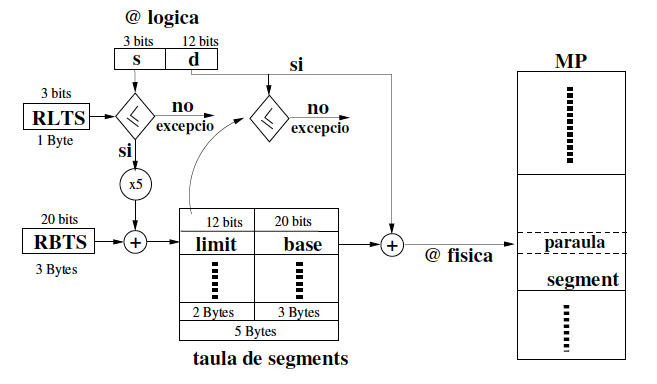
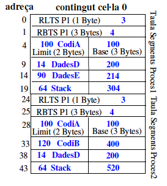
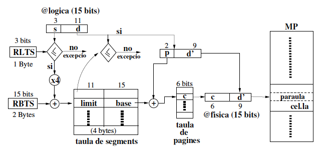
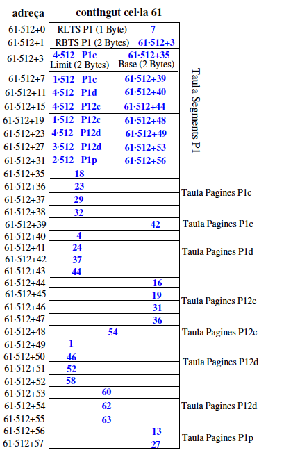

# Problemes de Gestió de Memòria

1. Suposa un sistema operatiu amb un **únic espai d'adreçament lògic**, on algunes adreces estan reservades pel nucli (*kernel*) i altres per l'espai d'usuari (*user*). Aquest sistema operatiu, de **64 bits**, pot gestionar com a màxim **4.194.304** processos a la seva taula de processos. A més, al nucli se li assigna la meitat de l'espai d'adreces lògiques. Si l'espai d'adreces lògiques es divideix equitativament entre tots els processos, **quin és l'espai mínim d'adreces lògiques que es reservaria per a cada procés quan hi ha el màxim nombre de processos en execució?**

    <details>
    <summary>Veure Solució</summary>

    1. L'espai d'adreces lògiques és de **64 bits**. Per tant, l'espai d'adreces lògiques total és de:

        $$2^{64}$$

    2. El nucli ocupa la meitat de l'espai d'adreces lògiques, de manera que l'espai d'adreces lògiques per als processos d'usuari:

        $$\frac{2^{64}}{2} = 2^{63}$$

    3. El nombre màxim de processos és de **4.194.304**. Per tant, l'espai d'adreces lògiques per a cada procés és:

        $$\frac{2^{63}}{4.194.304} = \frac{2^{63}}{2^{22}} = 2^{41}$$

    Aproximadament, cada procés tindria un mínim de **2 TB** d'espai d'adreces lògiques:

    $$2^{41} = 2^{40} \times 2^1 = 2 TB$$

    </details>

2. Considereu un sistema de particions múltiples on les particions a memoria principal són de mida fixa i en l'ordre següent:

    | Partició | Mida (MBytes) |
    | -------- | ------------- |
    | 1        | 10            |
    | 2        | 4             |
    | 3        | 20            |
    | 4        | 18            |
    | 5        | 7             |
    | 6        | 9             |
    | 7        | 12            |
    | 8        | 15            |

    a. Si la política d'assignació és **First Fit**, quina partició s'assignarà per processos successius de *12MBytes, 10MBytes i 9MBytes*?

    <details>
    <summary>Veure Solució</summary>
    En aquesta política, la primera partició que es troba amb suficient espai per allotjar el procés és la que s'assigna. Per tant, la partició que s'assigna per processos successius de *12MBytes, 10MBytes i 9MBytes* és la partició 3 (20MB), 1 (10MB) i 4(18MB) respectivament.
    </details>

    b. Si la política d'assignació és **Best-Available-Fit**, quina partició s'assignarà per processos successius de *12MBytes, 10MBytes i 9MBytes*?

    <details>
    <summary>Veure Solució</summary>
    En aquest política, la partició que s'assigna és la que té la mida més petita que sigui suficient per allotjar el procés. Per tant, la partició que s'assigna per processos successius de 12MBytes, 10MBytes i 9Bytes és la partició 7 (12MB), 1 (10 MB) i 6 (9MB) respectivament.
    </details>

    c. Si la política d'assignació és **Best-Fit-Only**, quina partició s'assignarà per processos successius de *12MBytes, 12MBytes i 9MBytes*?

    <details>
    <summary>Veure Solució</summary>
    En aquesta política, seleccionem la partició que té la mida més petita que sigui suficient per allotjar el procés. Però si esta ocupada esperem. Per tant, la partició que s'assigna per processos successius de 12MBytes, 12MBytes i 9MBytes és la partició 7 (12MB), 7 (12MB) i 6 (9MB) respectivament.
    </details>

3. Assumeix un sistema de paginació amb una mida de pàgina **P**. Determina una fòrmula que determini la direcció física **F** a partir de la direcció lògica **L**. Pots assumir que tp(p) retorna el contingut de la taula de pàgines a la posició p.

    <details>
    <summary>Veure Solució</summary>

    La fórmula per convertir una adreça lògica **L** en una adreça física **F** en un sistema de paginació és la següent:

    $$F = tp(\frac{L}{P}) \times P + L\\%P$$

    On:
    - $tp(\frac{L}{P})$ calcula a quina pàgina de l'adreça lògica **L** s'ha de referenciar.
    - $P$ és la mida de la pàgina.
    - Per obtenir el desplaçament dins de la pàgina, es fa el mòdul de l'adreça lògica **L** amb la mida de la pàgina **P**.
    </details>

4. Quin enginy utiltiza la **MMU** (Unitat de Gestió de la Memòria) per realitzar la fòrmula anterior de traducció de forma eficient?

    <details>
    <summary>Veure Solució</summary>

    La MMU (Unitat de Gestió de Memòria) força a les mides de pàgina siguin potències de 2. Això permet que la conversió de l'adreça lògica a l'adreça física sigui molt més eficient:

    1. Multiplicar o dividir per una potència de 2 és una operació molt eficient en binari (desplaçament de **k** bits a dreta o esquerra).
    2. El modul de **P** és equivalent a guardar els k bits menys significatius de l'adreça lògica (**L**).
    </details>

5. Suposa la següent traça d'execució per a un sistema amb una mida de pàgina de 512 bytes. El programa comença a l’adreça 1020, i la seva pila (*stack*) s'inicia a l’adreça 8192 (la pila creix cap a l’adreça 0). Determina les referències de pàgina generades per aquest programa. Tingues en compte les següents condicions:

   - Cada instrucció ocupa 1 paraula.
   - Cada paraula té una mida de 4 bytes.

   El codi del programa, en llenguatge ensamblador, és el següent:

   ```asm
   LOAD R0, 6144          ; Carregar la paraula de l’adreça 6144 al registre R0
   PUSH R0                ; Puja el contingut del registre R0 a la pila
   CALL 5120              ; Cridar una subrutina a l’adreça 5120, apilant l'adreça de retorn
   SUB SP, SP, #16        ; Restar la constant immediata 16 al punter de pila (SP)
   CMP R0, #4             ; Comparar el paràmetre actual (R0) amb la constant 4
   JEQ 5152               ; Saltar a l’adreça 5152 si la comparació és certa
   ```

   Quines són les referències de pàgina generades per aquest programa durant l'execució d'aquestes instruccions?

   <details>
   <summary>Veure Solució</summary>

   S'ha de diferencia entre les referències de pàgina generades per les instruccions (**I**) i les referències de pàgina generades per les dades (**D**).

   1. **LOAD R0, 6144**:
       - Aquesta instrucció es troba a la memòria i genera una referència de pàgina per la seva ubicació (**I**). El programa comença a l’adreça **1020**. Amb instruccions de **4 bytes**, aquesta instrucció està a la pàgina:
       $$ \lfloor 1020 / 512 \rfloor = 1 $$

       - També accedeix a l’adreça 6144 per carregar dades, generant una referència de pàgina (**D**). L’adreça 6144 es troba a la pàgina:
       $$ \lfloor 6144 / 512 \rfloor = 12 $$

   2. **PUSH R0**:
       - Aquesta instrucció es troba a la memòria i genera una referència de pàgina per la seva ubicació (**I**). Aquesta instrucció es troba a la pàgina següent dins del programa:
       $$ \lfloor (1020 + 4) / 512 \rfloor = 2 $$

       - També accedeix a la pila per escriure el valor del registre, generant una referència de pàgina (**D**). La pila comença a 8192, que es troba a la pàgina:
           $$ \lfloor 8192 / 512 \rfloor = 16 $$
           Després del **PUSH**, la pila decreix i accedeix a la **pàgina 15**. Això es deu a que la pila creix cap a l’adreça 0.

   3. **CALL 5120**:
       - Aquesta instrucció genera una referència de pàgina per les instruccions (**I**). Aquesta instrucció es troba a la pàgina **2**.

           $$ \lfloor (1024 + 4) / 512 \rfloor = 2 $$

           Fixeu-vos que la pila es troba a la pàgina **15**.

   4. **SUB SP, SP, #16**: Aquesta instrucció només modifica un registre, no genera cap referència de pàgina de dades.

   5. **CMP R0, #4**: Aquesta instrucció compara un registre amb una constant immediata, sense accedir a memòria. No genera referències de pàgina de dades.

   6. **JEQ 5152**: Aquesta instrucció es troba a la memòria i genera una referència de pàgina per la seva ubicació (**I**). Aquesta instrucció es troba a la pàgina **2**. A més, ens fa saltar a l'adressa **5152** per tant generem una referència de pàgina d'instrucció a la pàgina **10**:

    $$ \lfloor 5152 / 512 \rfloor = 10 $$

    | Instrucció          | **I** (Pàgina) | **D** (Pàgina) |
    |---------------------|----------------|----------------|
    | **LOAD R0, 6144**   | 1              | 12             |
    | **PUSH R0**         | 2              | 15             |
    | **CALL 5120**       | 2              | 15             |
    | **SUB SP, SP, #16** | —              | —              |
    | **CMP R0, #4**      | —              | —              |
    | **JEQ 5152**        | 10              | —              |

    </details>

6. La quantitat d'espai de disc que ha d'estar disponible per emmagatzemar pàgines està relacionada amb el nombre màxim de processos, **n**, el nombre de bytes de l'espai d'adreces virtual, **v**, i el nombre de bytes de RAM, **r**. Proporciona una expressió per als requisits d'espai de disc en el pitjor cas.

    <details>
    <summary>Veure Solució</summary>

    L'espai d'adreçament lògic per tots els processos és de **nv**, de manera que aquesta és la quantitat de pàgines necessària.

    No obstant això, una quantitat **r** pot estar a la RAM, de manera que la quantitat d'espai de disc necessària és només **nv - r**.

    Aquesta quantitat és molt més gran del que mai es necessitarà en la pràctica perquè rarament hi haurà **n** processos en **exec** al mateix temps. Encara més rarament tots ells necessitaran la memòria virtual màxima permesa.
    </details>

7. Suposem que disposem d’un sistema de gestió de la **Memòria Principal (MP)** del tipus paginat, amb una mida de pàgina (cel·la) de *8 KBytes*. La mida d’una paraula és *1 Byte* i la mida de MP és *4 MBytes*. La mida màxima d’un procés és *64 KBytes*. **La taula de pàgines h/w s’implementa en MP**.

   a. Esquema de traducció d’adreces lògiques a físiques, amb totes les mides de les estructures (o registres que hi apareguin). Poseu-hi també el(s) multiplicador(s) que cregueu convenient(s).

    <details>
    <summary>Veure Solució</summary>
    
    L'adreça lògica és dividida en dues parts: el desplaçament i el número de pàgina.

    - **Desplaçament**: La mida de la pàgina és de 8 KBytes -> \\(2^{13}\\) bytes, i per representar qualsevol desplaçament a l'interior d'una pàgina, necessitem 13 bits.

    - **Número de Pàgina**: Per a un nombre màxim de processos de 64KBytes = \\(2^{16}\\), el número màxim de pàgines és la raó entre el nombre màxim de processos i el desplaçament \\(\dfrac{2^{16}}{2^{13}}=2^3\\), per tant, requerim 3 bits per representar el número de pàgina.
  
    L'adreça física és dividida en dues parts: el número de cel·la i el desplaçament.

    - **Número de Cel·les de la Memòria**: El nombre de cel·les a la memòria es calcula igualment, considerant la mida de la pàgina. Si la mida de la Memòria Principal és de 4 MBytes, i la mida de la pàgina és de 8 KBytes, el nombre de bits necessaris per representar les cel·les és \\(\dfrac{2^{22}}{2^{13}}=2^9\\), per tant 9 bits.

    - **Adreça lògica** (16 bits): *Pagina* (3bits) + *Desplaçament* (13 bits); Per tant 2 Bytes.

    - **Adreça física** (22 bits): *Cel·la* (9 bits) + *Desplaçament* (13 bits); Per tant 3 Bytes.

    

    > **Nota**: El multiplicador és 2, ja que una entrada a la taula de pàgines ocupa 3 bits, i una entrada a la Taula de Pàgines ocupa 9 bits (2 Bytes). Per que les operacions siguin coherents, el multiplicador ha de ser 2.
    </details>

   b. Donat un procés **P1**, amb una mida total de 18 KBytes, es demana:

      - Rang d’adreçament lògic de P1.
  
    <details>
    <summary>Veure Solució</summary>

    |**p (3 bits)**|**d (13 bits)**               |
    |--------------|------------------------------|
    |000           |xxxxxxxxxxxxx                 |  
    |001           |xxxxxxxxxxxxx                 |
    |010           |0000000000000 -> 0011111111111|

    En aquesta taula la *x* representa totes les combinacions de 0 i 1.

    Com *P1* té una mida total de 18 KBytes, el nombre de pàgines és \\(\dfrac{18KBytes}{8KBytes}=2.25\\), per tant, necessitem 2 pàgines i 1/4 de pàgina. Per tant, la pagina 0 i 1 estan plenes i la pàgina 2 està a 1/4.

    > **Nota**: 2KBytes = \\(2^{11} \\)Bytes és 0011111111111 en binari.
    </details>

    - Fragmentació interna i externa total suposant que no hi ha cap més procés carregat en el sistema.

    <details>
    <summary>Veure Solució</summary>
    La Fragrmentació interna del procés P1 és de 6 KBytes, ja que la pàgina 2 està a 1/4. En aquest cas, la fragmentació externa és de 0, ja que la paginació permet que els processos no estiguin contigus a la memòria.
    </details>

    - Range d'adreçament físic de P1.

    <details>
    <summary>Veure Solució</summary>

    | cel·la (9 bits) | desplaçament (13 bits) |
    | --------------- | ---------------------- |
    | 50              | \\(50 \cdot 2^{13} \rightarrow (51 \cdot 2^{13}) - 1\\)         |
    | 34              | \\(34 \cdot 2^{13} \rightarrow (34 \cdot 35^{13}) - 1\\)         |
    | 3               | \\(3 \cdot 2^{13} \rightarrow (3 \cdot 3^{13} + 2^{11}) - 1\\)           |

    </details>

8. Disposem d’un sistema de gestió de la memòria segmentat. La Mida de Memòria Principal és de 1MByte. Un procés consta de com a molt 8 segments. La mida màxima d’un segment és 4KBytes. La taula de segments s'implementa en Memòria Principal. Donats els dos processos següents:

    | Segment | Mida        | Procés 1 | Procés 2 |
    | ------- | ----        | -------- | -------- |
    | Codi (A)| 100 bytes   | X        | X        |
    | Codi (B)| 120 bytes   |          | X        |
    | Dades (D)| 14 bytes   | X        | X        |
    | Dades (E)| 90 bytes   | X        |          |

    Les X’s en la taula indiquen quins procediments i dades estan assignats a cada procés. Una fila amb dos o més X’s indica que el segment està compartit. A més, cada procés està format per un segment d’stack de 64 Bytes.

    a. Doneu un exemple que mostri quina és la informació i la seva mida (en bytes), que ha de guardar el s.o. per tal de poder fer la traducció d’adreces dels dos processos quan aquests executin dins de la CPU.

    <details>
    <summary>Veure Solució</summary>

    

    - **Desplaçament**: La mida màxima d'un segment és de 4KBytes -> \\(2^{12}\\) bytes, i per representar qualsevol desplaçament a l'interior d'un segment, necessitem 12 bits.
    - **Segment**: Per a un nombre màxim de segments de 8, necessitarem \\(2^3\\), per tant, requerim 3 bits per representar el segment.
    - **Adreça lògica**: *Segment* (3 bits) + *Desplaçament* (12 bits); Per tant 2 Bytes.
    - **Adreça física**: La mida de la Memòria Principal és de 1MByte, per tant l'adreça física necessita 20 bits.
    - **Límit**: El límit és la mida del segment. Per tant, 12 bits.
    - **Base**: La base és la adreça on comença el segment. Per tant, una adreça física de 20 bits.

    > **Nota**: El multiplicador és 5, ja que una entrada a la taula de segments ocupa 3 bits, i una entrada a la Taula de Segments ocupa (5 Bytes). Per que les operacions siguin coherents, el multiplicador ha de ser 5.

    El contingut de en memòria és el següent, utilitzarem la primera cel·la disponible per guardar la informació, en aquest cas la cel·la 0.

    

    > **Nota**: Observeu que el primer que es guarda és el registre límit de la taula de segments P1 (RLTS) aquest registre ha d'indicar el nombre màxim de segments vàlids per P1.

    Com **P1** té 4 segments (Codi A, Dades D, Dades E i Stack) el contingut de *RLTS* és 3 (0,1,2,3). A continuació, es guarda el registre base taula de segments (RBTS) que indica on comença la taula de segments de P1.

    Com el RLTS ocupa (1Byte) el RBTS es pot guardar a la cel·la 0 però a +1Byte de distància. D'aquesta manera la taula de seguements de P1 començarà a +3Bytes de distancia de RBTS. A continuació, es guarda el límit del segment, seguit de la base del segment.

    - El primer segment és Codi A que ocupa 100 Bytes, per tant el límit és 100 i la base és l'adreça on començara el segment, En el nostre exemple, hem posat la 100.

    - El segon segment és de Dades D que ocupa 14 Bytes, per tant el límit és 14 i la base és 200. A continuació, es guarda el límit del segment, seguit de la base del segment.

    - El tercer segment és Dades E que ocupa 90 Bytes, per tant el límit és 90 i la base és 214.  

    - El quart segment és Stack que ocupa 64 Bytes, per tant el límit és 64 i la base és 304. Finalment, es guarda el límit del segment, seguit de la base del segment.

    Idem per P2. Únicament observeu que hi ha segments de dades compartits entre P1 i P2, per tant, el límit dels segments i les bases dels segments de dades són les mateixes.

    > Recordeu que el segments han de ser contigus a la memòria.

    </details>

9. Disposem d’un sistema de gestió de Memòria del tipus segmentació paginada. La mida d’una pàgina és de 512 paraules. La mida d’una paraula és igual a un Byte. Mida pàgina = Mida cel la. Un segment conté com a molt 4 pàgines. Un procés conté com a molt 8 segments. En la següent figura es pot veure el
contingut de MP:

    

    a. Esquema de traducció d’adreces lògiques a físiques, amb totes les mides de les estructures (o registres que hi apareguin). Poseu-hi també el(s) multiplicador(s) que cregueu convenient(s).
    
    <details>
    <summary>Veure Solució</summary>

    
            
    </details>

    b. Doneu un exemple de la informació (és a dir, d’una possible taula de segments,de les taules de pàgines i registres), que ha de guardar el sistema operatiu per gestionar la memòria del procés P1. Suposeu per fer-ho que totes les cel·les de P1 i P2 estan plenes. Suposeu també que tota la informació s’ha de posar a partir del començament de la cel la 61 i que aquesta informació ha d’ocupar el mínim espai possible.

    <details>
    <summary>Veure Solució</summary>

    
        
    </details>

    c. Doneu el rang d’adreçament lògic de P1.

    <details>
    <summary>Veure Solució</summary>

    

    </details>

    d. Quina és l'adreça lògica corresponent a l'adreça física 2050?

    <details>
    <summary>Veure Solució</summary>
    El nombre 2050 en binari és 000100000000010. Per tant, l'adreça lògica és:

    | s (3 bits) | p (2 bits) | d (9 bits) |
    | ---------- | ---------- | ---------- |
    | 010        | 00         | 000000010  |

    Aquesta adreça correspont al segment 3 (P1d), a la primera pàgina i a la 3ª paraula d'aquesta cel·la.
    </details>
